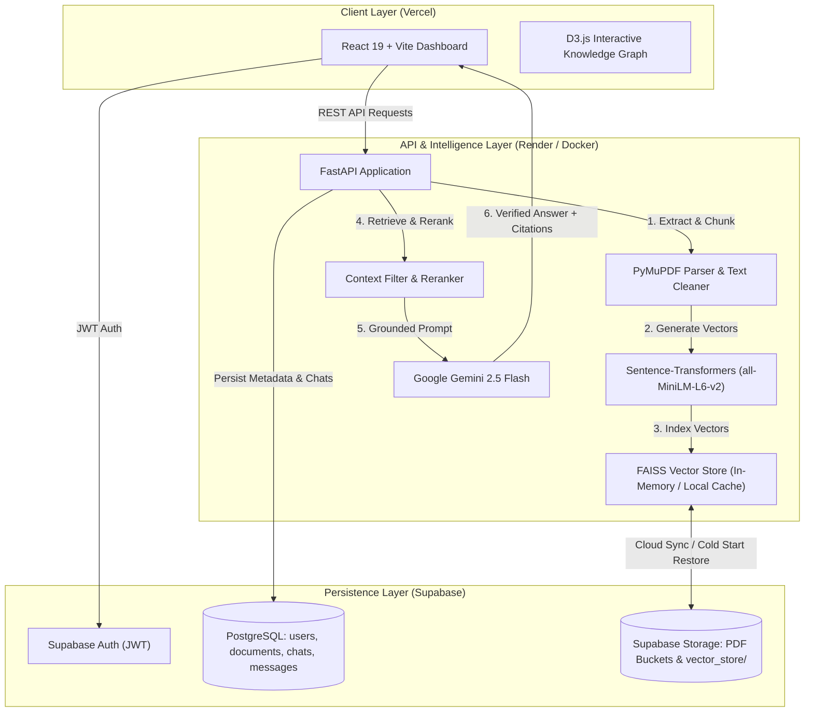

<div align="center">

# 🧠 DocuMind AI

### Intelligent Document RAG & Hierarchical Knowledge Graph Platform

[](https://github.com/your-username/Documind/actions/workflows/ci.yml)
[](https://fastapi.tiangolo.com/)
[](https://react.dev/)
[](https://tailwindcss.com/)
[](https://supabase.com/)
[](https://ai.google.dev/)
[](LICENSE)

*A production-ready, full-stack Retrieval-Augmented Generation (RAG) platform that transforms unstructured PDF documents into verifiable citations, vector embeddings, and interactive hierarchical knowledge graphs.*

---

</div>

## 📌 Table of Contents

- [Overview](#-overview)
- [Key Features](#-key-features)
- [System Architecture](#-system-architecture)
- [Tech Stack](#-tech-stack)
- [Project Structure](#-project-structure)
- [Getting Started](#-getting-started)
  - [Prerequisites](#prerequisites)
  - [Environment Variables](#environment-variables)
  - [Local Installation](#local-installation)
- [Running with Docker Compose](#-running-with-docker-compose)
- [Production Deployment](#-production-deployment)
  - [Backend on Render](#backend-on-render)
  - [Frontend on Vercel](#frontend-on-vercel)
- [API Overview](#-api-overview)
- [Contributing & License](#-contributing--license)

---

## 🚀 Overview

**DocuMind AI** bridges the gap between raw document archives and actionable intelligence. By pairing dense semantic retrieval (FAISS + Sentence-Transformers) with generative synthesis (Google Gemini), DocuMind AI delivers precise answers grounded in user-provided documents. Every response includes verifiable page citations to eliminate hallucinations.

In addition to conversational RAG, DocuMind features an interactive **D3.js Hierarchical Knowledge Graph and Tree Inspector**, allowing users to visually navigate core themes, concepts, and entity relationships extracted directly from their documents.

---

## ✨ Key Features

- **Document Parsing & Chunking**: Extracts text from PDFs using PyMuPDF (`fitz`), clean-formats strings, and applies recursive chunking with configurable overlap.
- **Dense Vector Embeddings & FAISS**: Uses `sentence-transformers/all-MiniLM-L6-v2` (384-dimensional embeddings) and `faiss-cpu` for sub-millisecond vector similarity search.
- **Cloud-Persisted Vector Index**: Automatically mirrors the local FAISS index (`index.faiss`) and metadata to Supabase Storage, auto-recovering state across ephemeral container restarts (e.g., Render free tier).
- **Interactive Knowledge Graph & Tree**:
  - Force-directed visual layout and tree breakdown built with D3.js.
  - Zero clutter: clean hierarchical edges, no intrusive grids, and calibrated spacing.
  - Interactive concept search, grounded node inspector, and direct node-to-chat Q&A.
- **Multi-Turn Chat History**: Persists chat threads and conversation turns in Supabase PostgreSQL with support for thread creation, renaming, and deletion.
- **Multi-Tenant Data Isolation**: Strict user-level document and chat segregation linked with Supabase Authentication.
- **Modern Responsive UI**: Slate-dark themed interface with smooth resizable split-panels, real-time status indicators, and markdown syntax highlighting.

---

## 🏗 System Architecture



---

## 🛠 Tech Stack

### Frontend
- **Framework**: React 19, Vite
- **Styling**: TailwindCSS v4
- **Visualizations**: D3.js (Force Simulation & Tree Layouts)
- **Icons & Markdown**: Lucide React, `react-markdown`, `remark-gfm`, `react-syntax-highlighter`
- **Networking**: Axios

### Backend
- **Framework**: FastAPI, Uvicorn
- **Language**: Python 3.11
- **Document Processing**: PyMuPDF (`pymupdf`)
- **Embeddings & Vector Search**: `sentence-transformers`, `faiss-cpu`, PyTorch (CPU)
- **Generative AI**: Google Gemini API (`google-genai`)
- **Data Validation**: Pydantic v2, `pydantic-settings`

### Infrastructure & Database
- **Database**: Supabase (PostgreSQL)
- **Object Storage**: Supabase Storage (`documents` bucket)
- **Containerization**: Docker, Docker Compose
- **Hosting**: Vercel (Frontend), Render (Backend)
- **CI/CD**: GitHub Actions

---

## 📁 Project Structure

```text
Documind/
├── .github/
│   └── workflows/
│       └── ci.yml                 # Single CI/CD workflow (Lint, compile & build)
├── backend/
│   ├── app/
│   │   ├── api/                   # FastAPI route controllers (auth, chat, docs, graph, etc.)
│   │   ├── core/                  # Configuration, Supabase client, user resolver
│   │   ├── models/                # Pydantic schemas and data models
│   │   └── services/              # Business logic (chunker, FAISS, LLM, knowledge graph)
│   ├── uploads/                   # Local file staging
│   ├── vector_store/              # Local FAISS index & metadata cache
│   ├── Dockerfile                 # Production Dockerfile (Python 3.11-slim + CPU PyTorch)
│   ├── .dockerignore
│   └── requirements.txt           # Curated production dependencies
├── frontend/
│   ├── src/
│   │   ├── components/            # UI components, cards, modal dialogs
│   │   │   └── KnowledgeGraph/    # D3 graph, tree view, concept inspector
│   │   ├── context/               # AuthContext & session state
│   │   ├── pages/                 # Dashboard, Login, Signup
│   │   └── services/              # Axios API service client
│   ├── vercel.json                # SPA rewrite rules for Vercel
│   ├── vite.config.js             # Vite build & chunk-splitting configuration
│   ├── Dockerfile                 # Frontend production container
│   └── package.json
├── docker-compose.yml             # Local multi-container orchestration
├── render.yaml                    # Render blueprint deployment specification
└── README.md
```

---

## 🏁 Getting Started

### Prerequisites

- **Node.js**: `v20.x` or higher
- **Python**: `3.11.x`
- **Supabase Account**: A free project on [supabase.com](https://supabase.com)
- **Google AI Studio API Key**: For Gemini LLM access ([aistudio.google.com](https://aistudio.google.com/))

---

### Environment Variables

#### Backend (`backend/.env`)
```env
PROJECT_NAME="DocuMind AI"
SUPABASE_URL="https://your-project-id.supabase.co"
SUPABASE_KEY="your-supabase-service-role-or-anon-key"
SUPABASE_BUCKET="documents"
GEMINI_API="your-google-gemini-api-key"
GEMINI_MODEL="gemini-2.5-flash"
```

#### Frontend (`frontend/.env` or Vercel Environment Variables)
```env
VITE_API_BASE_URL="http://localhost:8000"
```

---

### Local Installation

#### 1. Clone the Repository
```bash
git clone https://github.com/your-username/Documind.git
cd Documind
```

#### 2. Backend Setup
```bash
cd backend
python -m venv venv
# On Windows:
.\venv\Scripts\activate
# On Linux/macOS:
# source venv/bin/activate

pip install -r requirements.txt
uvicorn app.main:app --reload --port 8000
```
Backend will start at `http://127.0.0.1:8000`.

#### 3. Frontend Setup
```bash
cd ../frontend
npm install
npm run dev
```
Frontend will start at `http://localhost:5173`.

---

## 🐳 Running with Docker Compose

To spin up the entire application stack locally using Docker:

```bash
docker compose up --build
```

- **Frontend**: Accessible at `http://localhost:5173`
- **Backend**: Accessible at `http://localhost:8000`

---

## 🚢 Production Deployment

### Backend on Render
1. In [Render Dashboard](https://dashboard.render.com), click **New +** $\rightarrow$ **Web Service**.
2. Connect your repository.
3. Configure settings:
   - **Environment**: `Docker`
   - **Root Directory**: `backend`
   - **Instance Type**: `Free`
4. Under **Environment Variables**, add:
   - `SUPABASE_URL`, `SUPABASE_KEY`, `SUPABASE_BUCKET`
   - `GEMINI_API`, `GEMINI_MODEL`
   - `PORT`: `10000`
5. Deploy. Render will generate your public backend URL (e.g. `https://documind-backend.onrender.com`).

### Frontend on Vercel
1. In [Vercel Dashboard](https://vercel.com), click **Add New...** $\rightarrow$ **Project** and import your repository.
2. Configure settings:
   - **Framework Preset**: `Vite`
   - **Root Directory**: `frontend`
3. Under **Environment Variables**, add:
   - `VITE_API_BASE_URL`: `https://documind-backend.onrender.com` *(your Render backend URL, without trailing slash)*.
4. Click **Deploy**.

---

## 🔌 API Overview

| Method | Endpoint | Description |
| :--- | :--- | :--- |
| `POST` | `/signup` | Register a new user in Supabase Auth & public schema |
| `POST` | `/login` | Authenticate credentials and return JWT session token |
| `POST` | `/documents/upload` | Upload PDF, extract text, and stage metadata |
| `GET` | `/documents/user/{user_id}` | Fetch all documents owned by user (table + storage synced) |
| `DELETE` | `/documents/{document_id}` | Delete document, chunks, vector embeddings, and storage |
| `POST` | `/process/{document_id}` | Clean and segment PDF text into structured chunks |
| `POST` | `/embed/{document_id}` | Compute vector embeddings and append to FAISS store |
| `POST` | `/chat` | Grounded RAG query against indexed document chunks |
| `GET` | `/chats/user/{user_id}` | List user conversation threads |
| `GET` | `/chats/{chat_id}` | Retrieve message history for a specific thread |
| `POST` | `/chats/{chat_id}/messages` | Append user/assistant turn to thread history |
| `GET` | `/graph/{document_id}` | Fetch hierarchical entities, nodes, and links for Knowledge Graph |

---

## 📄 License

This project is licensed under the MIT License — see the [LICENSE](LICENSE) file for details.

<div align="center">
  <sub>Built with ❤️ by Ethan • Powered by FastAPI, React, Supabase & Google Gemini</sub>
</div>
